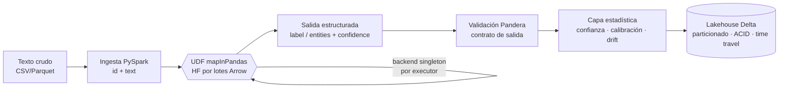

# ETL de gran escala enriquecido con GenAI


Pipeline de ETL distribuido (PySpark) que extrae texto no estructurado a gran escala y
lo estructura con modelos preentrenados de Hugging Face dentro de UDFs de Spark
(inferencia por lotes, sin cuello de botella), y lo persiste en un lakehouse Delta Lake.

El núcleo se construye una sola vez y se demuestra sobre tres dominios cambiando solo la
config (no se reescribe el pipeline). El sello del autor es estadístico: cada extracción
lleva un score de confianza, la calibración se trata con honestidad y se monitorea el drift
de la distribución del texto.

> Aplica modelos de IA sobre Big Data sin sacrificar el rendimiento del ETL distribuido.

## Dominios (mismo núcleo, distinta config)

| Dominio | Caso | Tarea |
|---|---|---|
| Salud | Estructurar notas clínicas / reportes de eventos adversos | NER de fármacos y síntomas |
| Educación | Evaluaciones docentes y feedback de estudiantes a escala | Sentimiento para detectar cursos en riesgo |
| Banca/retail | Reseñas de productos / noticias financieras | Sentimiento como señal de mercado |

## Arquitectura



## Cómo correr

```bash
uv sync                       # entorno reproducible (torch CPU, PySpark 4, Delta 4)
uv run pre-commit install     # hooks de calidad (opcional)

# 1) Generar datos sintéticos en español (sin red)
GENAI_BACKEND=mock uv run python scripts/generate_synthetic.py \
    --domain banking --rows 200 --out data/raw/banking.csv

# 2) Correr el pipeline (mock = sin descargar modelos)
GENAI_BACKEND=mock uv run python scripts/run_pipeline.py --config configs/banking.yaml

# 2b) Con modelos reales de Hugging Face (descarga la 1ª vez)
GENAI_BACKEND=hf uv run python scripts/run_pipeline.py --config configs/banking.yaml

# Tests y estilo
GENAI_BACKEND=mock uv run pytest
uv run ruff check . && uv run ruff format --check .
```

Salida: una tabla Delta particionada en `lakehouse/<dominio>/` con la columna
estructurada (`label` o `entities`) + `confidence`, y un resumen en consola (cobertura,
distribución de etiquetas, % bajo umbral de confianza).

## Decisiones técnicas

| Decisión | Elección | Por qué |
|---|---|---|
| Inferencia a escala | `mapInPandas` + singleton por executor | Lotes Arrow + modelo cargado una vez por proceso = sin cuello de botella |
| Lakehouse | Delta Lake | Cero fricción local con PySpark, ACID, time travel; Iceberg pediría catálogo externo |
| Backend de modelos | `mock` / `hf` / `auto` por env var | Tests/CI sin descarga ni GPU; cambia a HF real con una variable |
| Validación | Pandera sobre la *salida* | Contrato explícito de lo que produce el modelo |
| torch | ruedas CPU | Evita el build CUDA (~GB) en laptop/CI |
| JDK | Temurin 21 portátil | Spark 4.x no soporta el Java 25 del sistema; no se toca el Java global |

## Documentación

- [`docs/vision-tecnica.md`](docs/vision-tecnica.md): cómo y por qué funciona por dentro.
- [`docs/spark-genai-udf.md`](docs/spark-genai-udf.md): el patrón HF-en-Spark sin cuello de botella (el componente central).
- [`docs/referencia-codigo.md`](docs/referencia-codigo.md): archivo por archivo.
- [`docs/glosario.md`](docs/glosario.md): términos técnicos y de dominio.
- [`iac/README.md`](iac/README.md): aprovisionamiento local / EMR / Dataproc.
