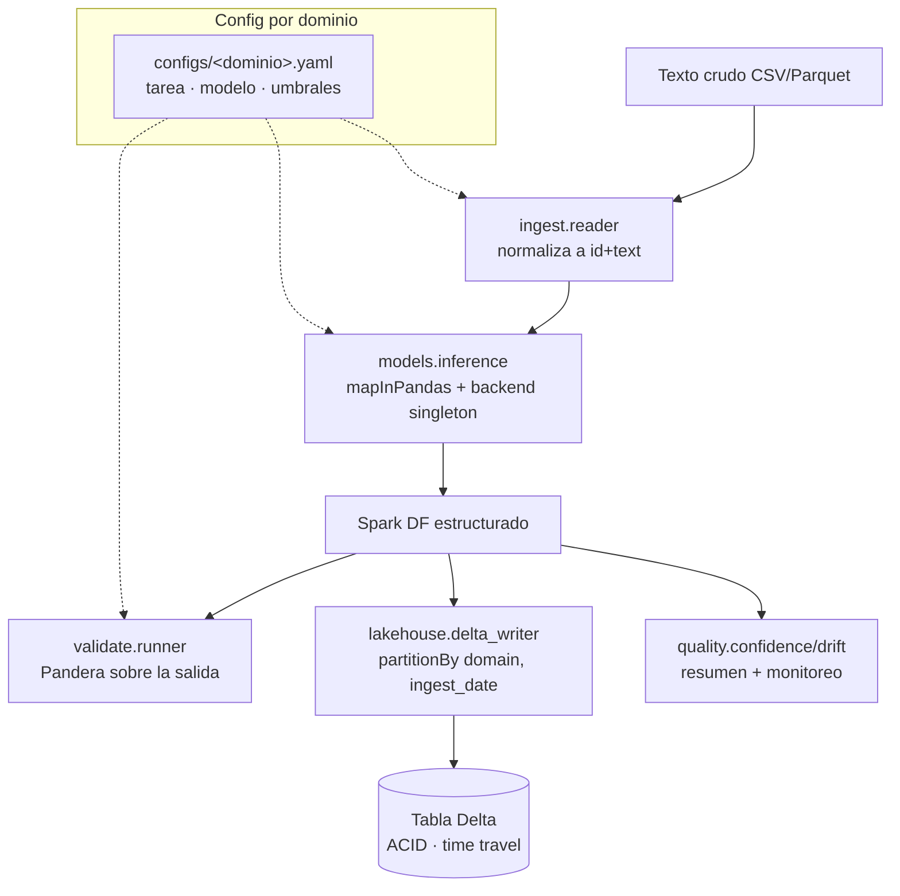

# Documento técnico — internals del pipeline

> El README es la vitrina; este documento explica **cómo funciona por dentro y por qué**.
> El detalle del patrón de inferencia vive aparte en [`spark-genai-udf.md`](spark-genai-udf.md).

## 1. Finalidad

Estructurar **texto no estructurado a gran escala** con modelos de lenguaje, de forma
distribuida y sin cuellos de botella, dejando una tabla consultable y auditable. El núcleo
es agnóstico al dominio: el mismo código sirve a salud (NER de fármacos/síntomas), educación
y banca (sentimiento) cambiando solo el archivo de config.

**Audiencia:** equipos de datos que necesitan enriquecer grandes volúmenes de texto
(reportes clínicos, feedback, reseñas, noticias) con NLP, manteniendo trazabilidad y
control de calidad estadístico.

## 2. Arquitectura

## 3. Etapas (qué entra, qué ocurre, qué sale)

| Etapa | Módulo | Entra | Sale |
|---|---|---|---|
| 1. Config | `config.py` | YAML del dominio | `DomainConfig` validado (Pydantic) |
| 2. Ingesta | `ingest/reader.py` | CSV/Parquet crudo | DataFrame Spark `id, text` |
| 3. Inferencia | `models/inference.py` | DataFrame `id, text` | `id, text, label/entities, confidence` |
| 4. Validación | `validate/runner.py` | salida en pandas | misma salida, o `SchemaErrors` |
| 5. Calidad | `quality/*` | salida en pandas | resumen de confianza, drift |
| 6. Persistencia | `lakehouse/delta_writer.py` | salida Spark | tabla Delta particionada |

El orquestador `enrich/pipeline.py` encadena 2→6 y devuelve un resumen.

## 4. Ejemplo input → output

**Entrada** (educación, `texto`): `"Excelente curso, el profesor explica muy claro y es muy útil."`

**Salida** (fila de la tabla Delta):

| id | label | confidence | domain | ingest_date |
|---|---|---|---|---|
| 0 | POS | 0.91 | education | 2026-06-17 |

**Entrada** (salud, `texto`): `"El paciente refiere cefalea y se le indicó ibuprofeno."`

**Salida**: `entities = [{text: "cefalea", type: SINTOMA, ...}, {text: "ibuprofeno", type: FARMACO, ...}]`, `n_entities = 2`, `confidence = 0.86`.

## 5. El sello estadístico

- **Confianza por extracción**: cada fila lleva `confidence ∈ [0,1]`. `min_confidence` (config)
  marca las extracciones dudosas (`low_confidence`) sin descartarlas.
- **Calibración honesta**: si hay ground-truth (el set sintético trae `etiqueta_real`), se
  reporta la **curva de fiabilidad** y el **ECE** (Expected Calibration Error). Sin
  ground-truth **no se finge** calibración: solo se reporta la distribución de confianza.
- **Drift**: PSI y test KS sobre la longitud del texto y PSI categórico sobre la mezcla de
  etiquetas, entre un lote de referencia y uno nuevo. Detecta deriva de la distribución de
  entrada antes de confiar en la salida.

## 6. Decisiones y trade-offs

- **Delta Lake vs Iceberg** → Delta: integración local sin catálogo externo, mismo discurso
  ACID/time travel. Iceberg brilla en escenarios multi-engine (Trino/Flink), que aquí no
  aplican; sería más setup para un portafolio que corre en laptop.
- **Pandera sobre la salida, no la entrada** → el valor está en garantizar lo que produce el
  modelo (etiqueta válida, confianza en rango, tipos de entidad esperados).
- **Validación/calidad en pandas** → el volumen de salida de un demo es modesto; materializar
  con `toPandas` (Arrow) es simple y suficiente. A escala real, estas métricas se calcularían
  con agregaciones Spark sobre la tabla Delta.
- **Backend swappable** → desacopla el flujo del proveedor del modelo; permite tests sin red
  y cambiar a HF real (o a otro proveedor) sin tocar el pipeline.

## 7. Cómo correr

Ver el README (sección "Cómo correr") y `iac/README.md` para el equivalente en cluster. En
resumen: `uv sync` y `GENAI_BACKEND=mock uv run python scripts/run_pipeline.py --config ...`.
